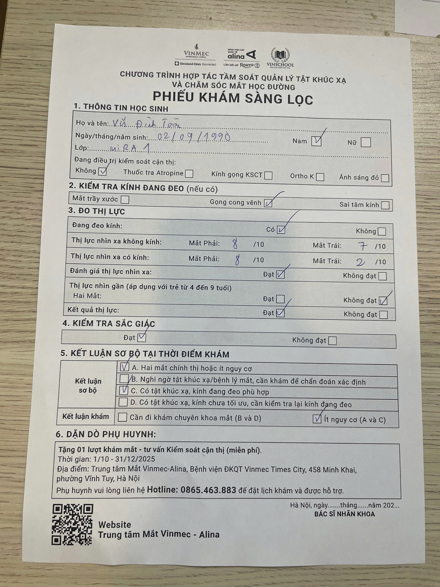
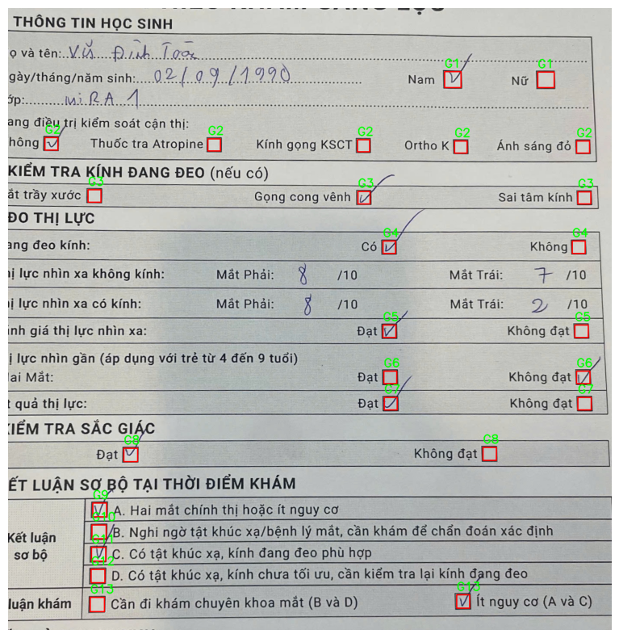

# Handwriting Extraction and Form Processing Pipeline

This project implements a modular **computer vision and OCR pipeline** for the automated extraction of handwritten and printed information from scanned forms such as student health or vision examination documents.  
It integrates **OpenCV**, **OCR engines**, and **Hugging Face vision-language models** to align, crop, interpret, and structure textual and visual data.

---

## Key Responsibilities and Technical Contributions

### Image Preprocessing and Alignment
- Developed an image alignment module using **Hough Line Transform** to automatically correct skew and orientation.
- Implemented dynamic canvas expansion and cropping to preserve document integrity after rotation.
- Optimized for consistent layout alignment in diverse scanning conditions.

### Region of Interest (ROI) Detection
- Built a **keyword-based cropping system** that detects text positions via OCR and extracts relevant content areas.
- Automated identification of top and bottom keyword anchors for accurate region segmentation.

### Handwriting and Text Recognition
- Integrated **Hugging Face transformer-based handwriting models** for high-accuracy recognition of handwritten text.
- Designed preprocessing pipelines with **ImageNet normalization**, bicubic interpolation, and batched inference.
- Produced structured, human-readable text output in Markdown format.

### Text Parsing and Information Extraction
- Implemented regex-based parsing utilities for extracting key-value fields from unstructured OCR output.
- Designed lightweight parsers for JSON-like text patterns to convert OCR data into nested Python dictionaries.

### Checkbox Detection and Classification
- Developed a checkbox detection algorithm using **morphological operations**, **connected components analysis**, and **K-Means clustering** for grouping.
- Built a classification model to label boxes as *Ticked* or *Unticked* based on pixel density ratios.
- Enabled robust multi-group checkbox recognition across complex form layouts.

### Business Logic and Semantic Mapping
- Encoded form-specific business logic to map detected checkboxes to domain-specific descriptors (e.g., gender, diagnosis outcome).
- Implemented multi-select and single-select logic handlers for grouped checkboxes.
- Produced structured summary dictionaries for downstream analytics or export.

---

## Input and Output Reference

**Input Image:**  
*Original scanned form before processing*  

**Output Image:**  
*Aligned, processed, and annotated result*  

---

## Technologies and Tools
- **OpenCV** – Image processing, rotation correction, and contour detection  
- **EasyOCR / Hugging Face Transformers** – Text and handwriting recognition  
- **NumPy / scikit-learn** – Clustering, geometric computation, and data structuring  
- **Matplotlib** – Visualization and annotation for debugging and inspection  

---

## Outcome
The resulting system can process scanned handwritten forms end-to-end, producing structured and machine-readable outputs suitable for automated data pipelines, health screening records, and educational administration systems.
